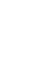

# Sniper

## 외형

아래로 매우 긴 **창·바늘** 실루엣. 몸통은 가늘고 날개 폭이 좁아, 조준선과 함께 “저격수”로 읽힌다.
- 스프라이트: `assets/enemies/enemy_sniper.svg`
- 틴트: 분홍 네온 (베이스 상속)

## 의도

**조준선으로 “지금 서 있는 자리”를 버리게** 만든다.
맞기 전에 그곳이 죽는 자리라는 걸 보여 주고, 움직이거나 끊게 한다. 앞에 Tanker 등이 있으면 “앞을 막은 채로 뒤를 노리는” 읽기가 생긴다.

## 플레이어가 고민할 점

- 조준이 모이는 타이밍에 자리를 비우기
- 앞을 가리는 가드·전방 실드 너머의 우선순위
- 가만히 서서 딜만 넣는 플레이를 끊기

## 하지 않는 것

- 경고 없는 고속 즉사탄 (선이 보여야 한다)
- 화면을 메우는 다연발 장판 (Caster 몫)
- 돌진 몸박 (Awl 몫)

## 편대·Encounter에서의 역할

가드 + Sniper 편대가 기본. 이미 탱커가 있으면 단독 보강으로 바뀔 수 있다 (구현).

## 확정 규칙·수치

| 항목 | 값 |
|------|-----|
| 씬 | `enemies/sniper_enemy.tscn` |
| HP | 95 |
| 점수 | 25 |
| 최소 Threat | 2+ (호위 Encounter) |

## 원거리 저격

- `sniper_entry_hold.tres`: `MoveToPositionStep`(y=48) → `HoldPositionMovementStep`
- `SniperAttackComponent`: AIMING(4.0s, 플레이어 추적 + 옅은 적색 이중선 cubic ease-out 수렴 → 0.18s 유지) → FIRING(900px/s + 5px 반동) → COOLDOWN(2.5s) 반복
- 조준선: 반각 14°→0.05°, 알파 0.01→0.36. 발사 순간 선 소실, 탄은 마지막 경로를 추적 없이 이동
- 재발사 시 재포지셔닝 없음. `EnemyShootComponent`는 `_enter_tree`에서 제거
- 단발 생성은 `SniperBarrageShot` 어댑터를 사용한다. 기존 SniperBullet의 선형 외형·900px/s 기준 3×30px 판정·사거리·피해량·finished 신호를 보존한다. 조준선·반동·타이밍은 SniperAttackComponent가 소유한다. 어댑터 연결이며 일반 FoundationBullet 몸체로 바꾸지 않는다.
- 반동은 ShakeComponent의 지속 위치 오프셋에 적용하고 피격 흔들림과 합산한다. 흔들림 갱신이 반동 위치를 원점으로 덮어쓰지 않는다.
- 편대 멤버로 스폰되면 그 자리에서 바로 조준을 시작한다(`sniper_reinforcement`는 1칸 편대라 진입하면서 첫 조준). 조준 중 편대 해제로 부모가 바뀌어도 조준선은 계속 보인다(`_enter_tree`에서 복구).

## 조합

- 기본: `tanker_guard_sniper` — 전방 Tanker + 후방 Sniper. 편대 유지 중 **Sniper만** 사격
- 탱커가 이미 살아 있으면 `sniper_reinforcement` 단독으로 대체
- Tanker 실드 피격: Flash + Scale ×1.08 (Shake 없음). 본체 Scale ×1.1 · Shake 0.5

→ [Encounter 카탈로그](../encounters/catalog.md)

## 진화형 (`enemies/evolved/sniper_evolved.tscn`)

적 증강 [진화: 연속 저격수](../augments.md#진화-증강)를 고르면 이후 Sniper가 이 씬으로 스폰된다. 1발째는 원본과 같다.

- 1발째 발사·반동이 끝나면 쿨다운 대신 2발째 **함정선**을 잡는다. 그 순간 플레이어 속도(약 0.1초 평활)로 계속 움직이면 2발째가 도달할 때 있을 지점을 계산해 선을 **한 번 고정**한다. 앞서는 시간은 (재조준 0.7초 + 유지 0.18초 + 탄 도달 시간) × `follow_up_lead`(1.0)다. 그 지점은 화면 안으로 제한한다. 선은 플레이어를 따라가지 않는다.
- 함정선 텔레그래프는 원본처럼 14°에서 벌어지지 않는다. **3°**(`follow_up_start_angle`)·밝기 절반(`follow_up_start_focus` 0.5)에서 시작해 **0.7초**(`follow_up_aim_duration`) 동안 수렴하고, 0.18초 유지 뒤 그 선으로 쏜다.
- 1발째를 피한 방향으로 계속 움직이면 맞고, 멈추거나 방향을 꺾으면 피한다. 멈춰 있던 플레이어에게는 1발째와 같은 자리를 다시 쏜다.
- 2발째 뒤에는 원본 쿨다운(2.5초)으로 돌아간다. ACTION_RATE는 재조준 시간에도 적용된다.

## 완료 조건·검증

- 기획에 명시된 등장 조건, 공격 예고·실행·종료와 보상 처리를 확인한다.
- 관련 씬의 수치와 위 규칙을 대조하고, 행동 변경 시 해당 적의 스모크 테스트를 실행한다.
- `sniper_reinforcement`로 나온 Sniper도 첫 조준선이 편대 해제 뒤까지 보인다.
- 진화형은 저격 직후 이동 예측 지점에 고정된 함정선을 좁게 띄우고, 0.7초 수렴·0.18초 유지 뒤 그 선으로 2발째를 쏜 다음 원본 쿨다운으로 돌아간다. 함정선은 플레이어를 따라가지 않는다.
