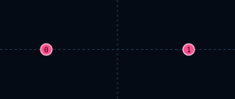

# BombPairFormation

| 항목 | 값 |
|------|-----|
| 씬 | `formations/layouts/bomb_pair_formation.tscn` |
| 슬롯 | 2 |
| 간격 | 좌우 ±80 (160px) |

간격은 Bomb 신관 반경 60px 두 개 사이에 폭 40px 통로가 남도록 정했다.

## 슬롯

| Slot | id | 오프셋 (x, y) |
|------|-----|---------------|
| 0 | `left` | (-80, 0) |
| 1 | `right` | (80, 0) |

## 사용 Encounter

- `bomb_pair` — 즉시 해제 후 각 Bomb가 직선 하강 ([Bomb](../enemies/bomb.md))
