# 진형 (Formation)

진형 = **슬롯 기하만**. 어떤 적이 앉는지·어떻게 움직이는지는 [Encounter](../encounters/index.md)가 정한다.
같은 레이아웃을 여러 Encounter가 재사용한다 (예: Diamond5 → Striker 호위 / Bomb 호위).

코드: `formations/layouts/*.tscn` · `FormationLayout` / `FormationSlot`  
배치 그림: `docs/design/formations/sprites/layout_*.svg` (슬롯 번호 = `slot_index`, 점선 교차 = 편대 원점 `(0,0)`, 화면 위 = Godot `-y`)

그림을 다시 뽑을 때: `tools/gen_formation_diagrams.py` (또는 동일 로직의 PowerShell 생성).

## 레이아웃 목록

| 레이아웃 | 배치 | 슬롯 | 상세 |
|----------|------|------|------|
| Horizontal | 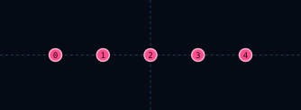 | 5 | [horizontal](horizontal.md) |
| Diamond5 | 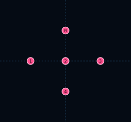 | 5 | [diamond-5](diamond-5.md) |
| Diamond13 | 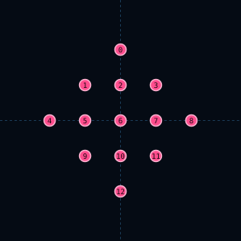 | 13 | [diamond-13](diamond-13.md) |
| V3 | 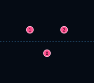 | 3 | [v3](v3.md) |
| V5 |  | 5 | [v5](v5.md) |
| V7 |  | 7 | [v7](v7.md) |
| V9 | 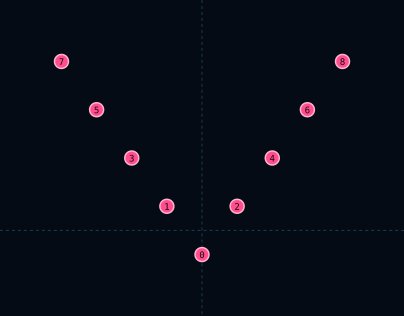 | 9 | [v9](v9.md) |
| Inverted V3 | 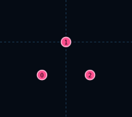 | 3 | [inverted-v3](inverted-v3.md) |
| Inverted V5 |  | 5 | [inverted-v5](inverted-v5.md) |
| Inverted V7 | 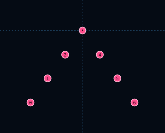 | 7 | [inverted-v7](inverted-v7.md) |
| X5 |  | 5 | [x5](x5.md) |
| X9 | 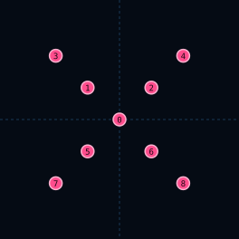 | 9 | [x9](x9.md) |
| Triangle6 |  | 6 | [triangle6](triangle6.md) |
| InterceptorPair | 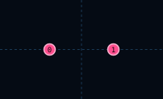 | 2 | [interceptor-pair](interceptor-pair.md) |
| Single | 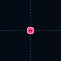 | 1 | [single](single.md) |
| Vertical | 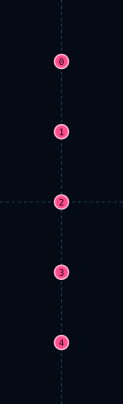 | 5 | [vertical](vertical.md) |

## 드론 Encounter ↔ 진형

드론이 본체·호위로 들어가는 조합. 멤버·이동 수치는 [catalog](../encounters/catalog.md).

| Encounter | 진형 | 배치 미리보기 | 비고 |
|-----------|------|---------------|------|
| `drone_formation` | [Horizontal](horizontal.md) |  | 풀 · WAVE `straight` |
| `drone_zigzag_mirrored` / `drone_zigzag_formation` | [V5](v5.md) |  | 풀 · WAVE `zigzag` |
| `drone_triangle_formation` | [Triangle6](triangle6.md) |  | WAVE · 풀 밖 |
| `striker_drone_diamond_5` | [Diamond5](diamond-5.md) |  | Slot0 Striker + Drone×4 |
| `striker_drone_diamond_13` | [Diamond13](diamond-13.md) |  | Slot0 Striker + Drone×12 |
| `bomb_drone_diamond` | [Diamond5](diamond-5.md) |  | Bomb center + Drone×4 |
| `v7_drone_down` | [V7](v7.md) |  | Threat 3+ |
| `x9_drone_down` | [X9](x9.md) |  | Threat 3+ |
| `x9_caster_drone_orbit` | [X9](x9.md) |  | Caster 중심 + Drone×8 |
| `v3` / `v5` / `v9` / `inverted_*` / `x5_drone_down` | 동명 진형 | (위 표) | 테스트·레거시 · 풀 미등록 |

## 작성 규칙

- 오프셋·슬롯 이름·배치 그림만 기록
- 멤버 배치는 Encounter MD / [catalog](../encounters/catalog.md)에
- 신규 진형 feature → 이 폴더에 페이지·SVG 추가 + `design.js` 등록 + Encounter에서 링크

## 변경 이력

- 2026-09-15: 레이아웃 배치 SVG와 드론 Encounter 대응 표를 카탈로그에 추가.
- 2026-09-13: 주제별 통합 기획서로 이전.
