# 진형 (Formation)

진형 = **슬롯 기하만**. 어떤 적이 앉는지·어떻게 움직이는지는 [Encounter](../encounters/index.md)가 정한다.
같은 레이아웃을 여러 Encounter가 재사용한다 (예: Diamond5 → Striker 5 호위 / Single → Caster · Courier).

코드: `formations/layouts/*.tscn` · `FormationLayout` / `FormationSlot`  
배치 그림: `docs/design/formations/sprites/layout_*.svg` (슬롯 번호 = `slot_index`, 점선 교차 = 편대 원점 `(0,0)`, 화면 위 = Godot `-y`)

그림을 다시 뽑을 때: `tools/gen_formation_diagrams.py` (또는 동일 로직의 PowerShell 생성).

## 레이아웃 목록

| 레이아웃 | 배치 | 슬롯 | 상세 |
|----------|------|------|------|
| Horizontal | 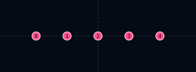 | 5 | [horizontal](horizontal.md) |
| Diamond5 | 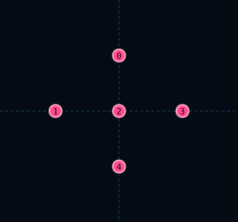 | 5 | [diamond-5](diamond-5.md) |
| Diamond13 | 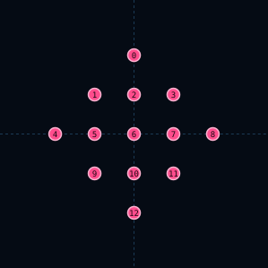 | 13 | [diamond-13](diamond-13.md) |
| V3 | 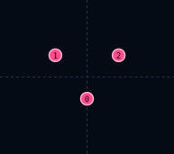 | 3 | [v3](v3.md) |
| V5 | 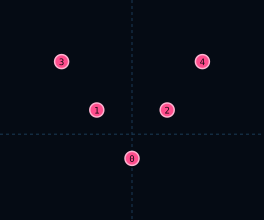 | 5 | [v5](v5.md) |
| V7 | 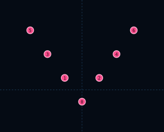 | 7 | [v7](v7.md) |
| V9 | 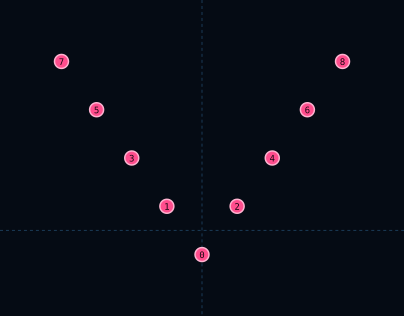 | 9 | [v9](v9.md) |
| Inverted V3 | 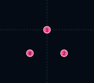 | 3 | [inverted-v3](inverted-v3.md) |
| Inverted V5 | 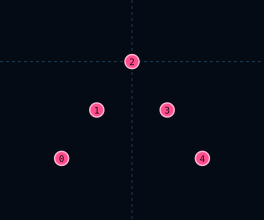 | 5 | [inverted-v5](inverted-v5.md) |
| Inverted V7 | 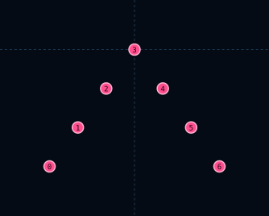 | 7 | [inverted-v7](inverted-v7.md) |
| X5 | 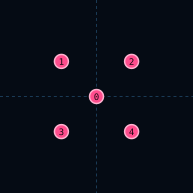 | 5 | [x5](x5.md) |
| X9 | 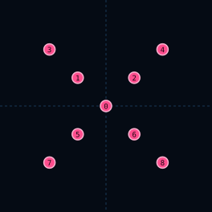 | 9 | [x9](x9.md) |
| Triangle6 | 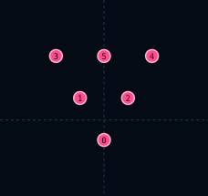 | 6 | [triangle6](triangle6.md) |
| InterceptorPair | 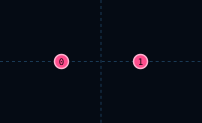 | 2 | [interceptor-pair](interceptor-pair.md) |
| BombPair |  | 2 | [bomb-pair](bomb-pair.md) |
| Single | 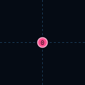 | 1 | [single](single.md) |
| Vertical | 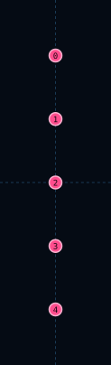 | 5 | [vertical](vertical.md) |

## 드론 Encounter ↔ 진형

드론이 본체·호위로 들어가는 조합. 멤버·이동 수치는 [catalog](../encounters/catalog.md).

| Encounter | 진형 | 배치 미리보기 | 비고 |
|-----------|------|---------------|------|
| `drone_formation` | [Horizontal](horizontal.md) |  | 풀 · WAVE `straight` |
| `drone_zigzag_mirrored` / `drone_zigzag_formation` | [V5](v5.md) |  | 풀 · WAVE `zigzag` |
| `drone_triangle_formation` | [Triangle6](triangle6.md) |  | WAVE · 풀 밖 |
| `striker_drone_diamond_5` | [Diamond5](diamond-5.md) |  | Slot0 Striker + Drone×4 |
| `striker_drone_diamond_13` | [Diamond13](diamond-13.md) |  | Slot0 Striker + Drone×12 |
| `v7_drone_down` | [V7](v7.md) |  | Threat 3+ |
| `x9_drone_down` | [X9](x9.md) |  | Threat 3+ |
| `x9_caster_drone_orbit` | [X9](x9.md) |  | Caster 중심 + Drone×8 |
| `v3` / `v5` / `v9` / `inverted_*` / `x5_drone_down` | 동명 진형 | (위 표) | 테스트·레거시 · 풀 미등록 |

## 편대 이동 경계 (벽 반사)

지그재그·대각 유지 편대(`BoundedDiagonalMovementStep`, 시퀀스 `zigzag`·`formation_drone_diagonal`)는 **편대가 실제로 차지한 폭**으로 벽에 반사한다. 멤버가 화면 밖으로 나가지 않고, 날개가 죽으면 그만큼 더 벽에 붙는다.

- **점유 폭**: `FormationController`가 매 프레임 살아 있는 멤버의 슬롯 오프셋(behavior 변환·mirrored 반영)으로 중심에서 가장 왼쪽/오른쪽 멤버까지 거리 `formation_extent_left` / `formation_extent_right`를 계산해 중앙 `MovementController` 컨텍스트에 쓴다. 멤버 스폰이 아직 남아 있으면 저작된 슬롯 전부를 센다(늦게 스폰된 날개가 밖에 태어나지 않게). 옛 `formation_half_span`은 둘 중 큰 값으로 함께 발행한다.
- **반사 경계**: VisibleRect 좌우를 `edge_margin`(기본 12px, 드론 반폭 8px + 여유)만큼 안쪽으로 들인 선이다. 중심의 허용 구간은 `[left + margin + extent_left, right - margin - extent_right]`이고, 구간을 넘는 이동량은 거울처럼 되돌리며 진행 방향을 뒤집는다. MovementArea(화면보다 넓은 영역)는 더 이상 편대 반사에 쓰지 않는다.
- **밖에 있을 때**: 중심이 이미 구간 밖이면(화면 밖 스폰 `spawn_in_movement_area`, 늦은 스폰으로 구간이 줄어든 순간) 위치를 튀기지 않고 안쪽 방향으로만 향하게 한다. 구간 안에 들어온 뒤부터 반사한다.
- **폭이 화면보다 넓을 때**: 중심을 구간 중앙에 고정하고 하강만 한다.
- 날개가 죽어 구간이 넓어지는 쪽은 즉시 반영되고 튐이 없다(허용 범위만 커진다).

완료 조건·검증: 좌/우 extent로 비대칭 반사, 밖에서는 튐 없이 안쪽 진행, half_span 폴백, 멤버 사망·mirrored 시 extent 갱신, 지그재그 편대 멤버가 1500프레임 동안 카메라 안에 머물고 날개 사망 후 중심이 더 멀리 감 — `tests/formation_bounce_extent_test.gd`. 단일 액터 반사는 `tests/movement_space_smoke_test.gd`.

## 작성 규칙

- 오프셋·슬롯 이름·배치 그림만 기록
- 멤버 배치는 Encounter MD / [catalog](../encounters/catalog.md)에
- 신규 진형 feature → 이 폴더에 페이지·SVG 추가 + `design.js` 등록 + Encounter에서 링크
