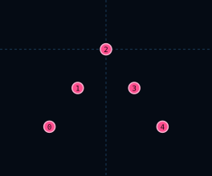

# InvertedV5Formation

| 항목 | 값 |
|------|-----|
| 씬 | `formations/layouts/inverted_v5_formation.tscn` |
| 슬롯 | 5 |

## 슬롯

| Slot | id | 오프셋 (x, y) |
|------|-----|---------------|
| 0 | `left_outer` | (-32, 44) |
| 1 | `left_inner` | (-16, 22) |
| 2 | `point` | (0, 0) |
| 3 | `right_inner` | (16, 22) |
| 4 | `right_outer` | (32, 44) |

## 사용 Encounter

- `inverted_v5_drone_down` — 테스트·레거시 · MainEncounterPool 미등록
