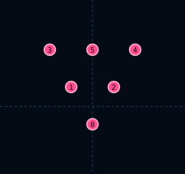

# Triangle6Formation

| 항목 | 값 |
|------|-----|
| 씬 | `formations/layouts/triangle6_formation.tscn` |
| 슬롯 | 6 (앞 tip + 뒤 베이스 5) |

## 슬롯

| Slot | id | 오프셋 (x, y) |
|------|-----|---------------|
| 0 | `point` | (0, 10) |
| 1 | `left_inner` | (-12, -11) |
| 2 | `right_inner` | (12, -11) |
| 3 | `left_outer` | (-24, -32) |
| 4 | `right_outer` | (24, -32) |
| 5 | `base_center` | (0, -32) |

## 사용 Encounter

- `drone_triangle_formation` — Drone ×6 · WAVE `triangle` · MainEncounterPool 미등록
