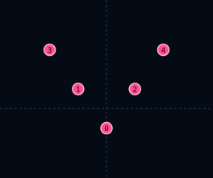

# V5Formation

| 항목 | 값 |
|------|-----|
| 씬 | `formations/layouts/v5_formation.tscn` |
| 슬롯 | 5 (V3에 바깥 날개 추가) |

## 슬롯

| Slot | id | 오프셋 (x, y) |
|------|-----|---------------|
| 0 | `point` | (0, 11) |
| 1 | `left_inner` | (-16, -11) |
| 2 | `right_inner` | (16, -11) |
| 3 | `left_outer` | (-32, -33) |
| 4 | `right_outer` | (32, -33) |

## 사용 Encounter

- `drone_zigzag_mirrored` / `drone_zigzag_formation` — Drone ×5 · zigzag · WAVE `zigzag`
- `v5_drone_down` — 테스트·레거시
