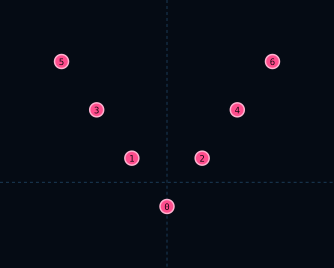

# V7Formation

| 항목 | 값 |
|------|-----|
| 씬 | `formations/layouts/v7_formation.tscn` |
| 슬롯 | 7 |

## 슬롯

| Slot | id | 오프셋 (x, y) |
|------|-----|---------------|
| 0 | `center_point` | (0, 11) |
| 1 | `left_inner` | (-16, -11) |
| 2 | `right_inner` | (16, -11) |
| 3 | `left_middle` | (-32, -33) |
| 4 | `right_middle` | (32, -33) |
| 5 | `left_outer` | (-48, -55) |
| 6 | `right_outer` | (48, -55) |

## 사용 Encounter

- `v7_drone_down` — Drone · midmap 하강 후 산개 (풀 Threat 3+)
