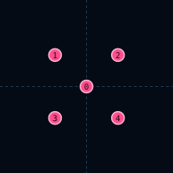

# X5Formation

| 항목 | 값 |
|------|-----|
| 씬 | `formations/layouts/x5_formation.tscn` |
| 슬롯 | 5 (작은 X) |

## 슬롯

| Slot | id | 오프셋 (x, y) |
|------|-----|---------------|
| 0 | `center_anchor` | (0, 0) |
| 1 | `upper_left` | (-16, -16) |
| 2 | `upper_right` | (16, -16) |
| 3 | `lower_left` | (-16, 16) |
| 4 | `lower_right` | (16, 16) |

## 사용 Encounter

- `x5_drone_down` — 테스트·레거시 · MainEncounterPool 미등록
